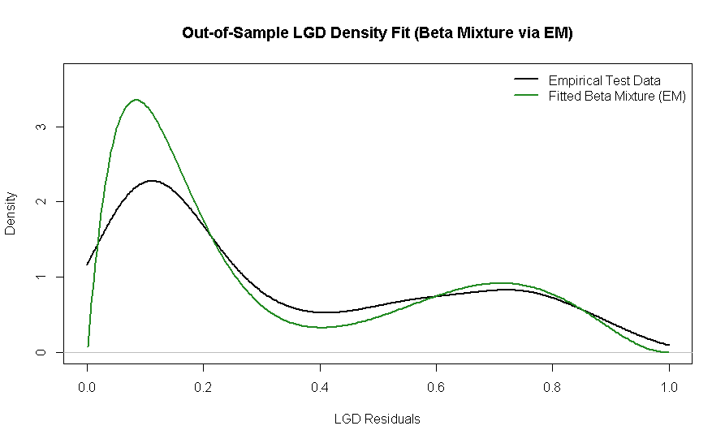

# Beta Mixture Model (BMM) for Loss Given Default (LGD) Residuals


## Overview

This repository provides an end-to-end framework for modeling multimodal Loss Given Default (LGD) residual distributions using a **custom Expectation-Maximization (EM) algorithm for Beta Mixture Models (BMM)**.

In Advanced IRB regulatory credit risk frameworks, LGD residuals (e.g., $LGD_{\text{realized}} - ELGD_{\text{baseline}}$) frequently exhibit non-normality, multimodality, and strict boundaries on $[0,1]$. Standard Gaussian Mixture Models (GMMs) lead to probability leakage outside $[0,1]$. This project addresses those limitations by fitting $K$-component Beta mixtures via closed-form Method-of-Moments updates in the M-step.

---

## Mathematical Formulation

The density function of a $K$-component Beta Mixture Model is defined as:

$$
f(x \mid \boldsymbol{\omega}, \boldsymbol{\alpha}, \boldsymbol{\beta}) = \sum_{k=1}^{K} \omega_k \, \frac{x^{\alpha_k - 1}(1 - x)^{\beta_k - 1}}{B(\alpha_k, \beta_k)}
$$

where $\sum_{k=1}^K \omega_k = 1$ and $B(\cdot, \cdot)$ represents the Beta function.

### Expectation-Maximization Algorithm

1. **E-Step (Responsibility Calculation):**

$$
\gamma_{ik} = \frac{\omega_k \, \text{Beta}(x_i \mid \alpha_k, \beta_k)}{\sum_{j=1}^K \omega_j \, \text{Beta}(x_i \mid \alpha_j, \beta_j)}
$$

2. **M-Step (Parameter Updates via Weighted Method-of-Moments):**

$$
\hat{\mu}_k = \frac{\sum_{i=1}^N \gamma_{ik} x_i}{\sum_{i=1}^N \gamma_{ik}}, \quad \hat{\sigma}^2_k = \frac{\sum_{i=1}^N \gamma_{ik} (x_i - \hat{\mu}_k)^2}{\sum_{i=1}^N \gamma_{ik}}
$$

$$
\hat{\alpha}_k = \hat{\mu}_k \left( \frac{\hat{\mu}_k(1 - \hat{\mu}_k)}{\hat{\sigma}^2_k} - 1 \right), \quad \hat{\beta}_k = (1 - \hat{\mu}_k) \left( \frac{\hat{\mu}_k(1 - \hat{\mu}_k)}{\hat{\sigma}^2_k} - 1 \right)
$$

---

## Key Features

* **Custom EM Engine:** Built from scratch without external mixture packages to ensure explicit control over convergence criteria and boundary constraints.
* **Out-of-Sample Model Validation:** Automated $80/20$ train/test splitting evaluated against the empirical CDF (eCDF).
* **Goodness-of-Fit Suite:** Automated execution of Kolmogorov-Smirnov (KS), Anderson-Darling (AD), and Cramér-von Mises (CvM) hypothesis tests across temporal cohorts.
* **Model Order Selection:** Systematic component evaluation ($K \in [2, 5]$) tracking AIC and BIC penalization.
* **Convergence Sensitivity Analysis:** Random quantile-based initialization routines (`EMRandom`) to test solver stability against local likelihood maxima.

---

## Quickstart

### Prerequisites
```R
install.packages(c("dplyr", "ggplot2", "goftest"))
```

### Execution
1. Clone the repository:
   ```bash
   git clone https://github.com/VincentHeyn/beta-mixture-lgd-em.git
   cd beta-mixture-lgd-em
   ```
2. Run the main pipeline:
   ```R
   source("main.R")
   ```
   
---

## Empirical Results & Model Output

### 1. Model Selection (AIC / BIC Criteria)
The Expectation-Maximization (EM) algorithm was evaluated across $K \in \{1, 2, 3, 4\}$ candidate mixture components on training data ($N_{\text{train}} = 800$).

| $K$ Components | Log-Likelihood | AIC | BIC | Decision |
| :---: | :---: | :---: | :---: | :---: |
| $K = 1$ | 301.6556 | -599.3111 | -588.1093 | Underfitted (Unimodal) |
| $K = 2$ | 664.6890 | -1319.3779 | -1291.3734 | **Optimal Model (Selected via BIC)** |
| $K = 3$ | 664.9841 | -1313.9681 | -1269.1609 | Overfitted |
| $K = 4$ | 663.1511 | -1304.3021 | -1242.6922 | Overfitted |

* **Result:** Bayesian Information Criterion (BIC) penalizes model complexity and selects **$K = 2$** as the optimal number of components, successfully isolating the bimodal structure of loss recoveries without overfitting.

---

### 2. Out-of-Sample Goodness-of-Fit Tests
Evaluated on holdout test data ($N_{\text{test}} = 200$) using non-parametric goodness-of-fit hypothesis testing:

| Test | $p$-value | Decision ($\alpha = 0.05$) |
| :--- | :---: | :--- |
| **Kolmogorov-Smirnov Test** | **0.4561** | Fail to reject $H_0$ (Good fit) |
| **Anderson-Darling Test** | **0.6036** | Fail to reject $H_0$ (Good tail fit) |

---

### 3. Basel III Regulatory Credit Risk Metrics
Calculated from the optimal $K=2$ Beta Mixture distribution parameters:

| Metric | Mathematical Form | Value | Regulatory Significance |
| :--- | :--- | :---: | :--- |
| **Expected LGD ($\mathbb{E}[\text{LGD}]$)** | $\sum \omega_k \frac{\alpha_k}{\alpha_k + \beta_k}$ | **32.35%** | Baseline loss rate for Expected Loss (EL) |
| **LGD VaR ($99.9\%$)** | $F^{-1}(0.999)$ | **95.66%** | 99.9th percentile worst-case loss threshold |
| **ES ($99.9\%$)** | $\frac{1}{0.001} \int_{\text{VaR}}^{1} x f(x) dx$ | **96.74%** | Conditional tail loss during severe economic distress |

---

### 4. Density Fit & Tail Risk Visualization



---

## Author
* **[Vincent Heyn]** – [LinkedIn Profile](www.linkedin.com/in/vincent-heyn-8065251b1) | [Email](mailto:vincenttanwaheyn@gmail.com
)
